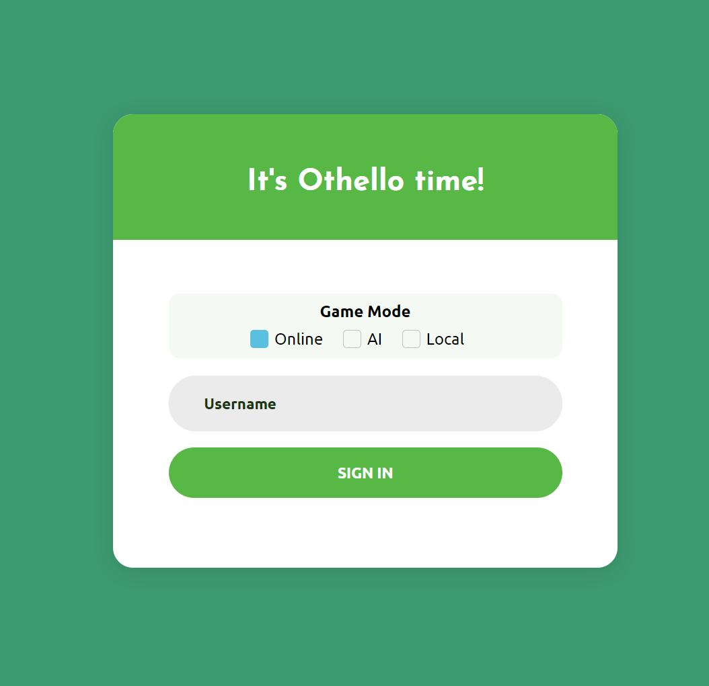
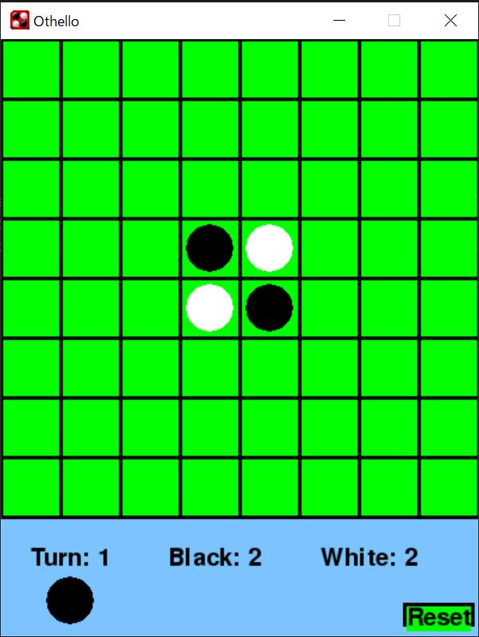

# myOthello
This repo holds a little Othello game I made using pygame, which I eventually improved on and ported to Javascript + Python when creating [myothello.club](https://myothello.club)

## What is Othello?
Known by other names such as reversi and renegade, Othello is a two-player board game where players take turns placing pieces on an 8x8 grid while striving to control the greatest amount of pieces by the end of the game. The rules of the game are simple, and are more thoroughly explained by [this wikiHow article](https://www.wikihow.com/Play-Othello), but the general idea is that one must surround opposing pieces with one's own in order to capture them, making them switch allegiances. The game takes minutes to learn but years to master, as the possibilities for different moves increase in a combinatorial fashion as the game progresses. Furthermore, one of the key aspects of Othello that distinguishes from other strategy games is the speed at which the tide of the match can shift, and it is not uncommon for a player who is all but wiped out to secure some strategic positions and be able to win back the board within the last few turns of the game.

## What's special about myOthello?
My Othello is a project born to explore and improve upon my programming skills in several areas. In particular, I was interested to gain experiences working with web technologies such as WebSockets and Python+Flask under an AWS framework, as well as implementing some theoretical knowledge of AI strategies such as adversarial search and alpha-beta pruning, all bundled up into a fun personal project I could share with my friends and family. myOthello provides a responsive platform for playing Othello online with others, against an AI opponent, or locally with a friend. It's easily accessible through a web browser, responsive for both Desktop and Mobile users, and shows that nice little TLS lock that reassures users of their data security (even though myOthello does not request any personally identifiable information or track you in any way).

## What's the difference between the Python and the Web version of myOthello
The Python version hosted on this repository is just a simple proof of concept I did for myself. It's hosted here for archiving purposes, but realistically is entirely outclassed and meant to be replaced by [myothello.club](https://myothello.club)

Python version             |  Web version
:-------------------------:|:-------------------------:
  |  

## How's myOthello structured?
myOthello can have any number of pairs of clients, which connect to a matchmaking server that deals with pairing them up and mediates their communication. Additionally, there are two lamda function endpoints, GameLogic and AI, which deal with calculating game state transitions and AI moves, respectively. Here's a schematic:

